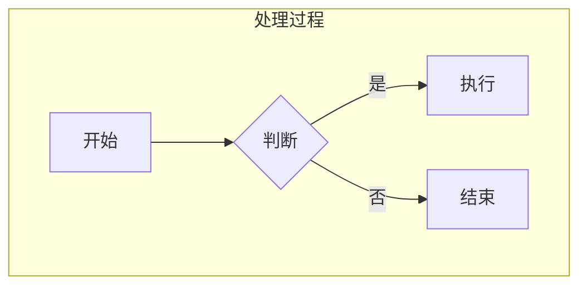

# BetterBook · 更好的书

**在 Minecraft 中直接编写、排版和发布交互式手册。**

BetterBook 为整合包作者、服务器管理员和模组开发者提供所见即所得的书籍编辑器。你可以像编辑文档一样写教程，把物品、实体、结构模型和配方放进书页，再用一本物品或一座讲台把手册交给玩家。

阅读器采用原版风格的双页书本，支持独立滚动、图标翻页、目录跳转和返回。编辑区使用同一套纸张与内容渲染，让创作时看到的效果更接近成书。


## 可以用它做什么

| 内容 | 功能 |
| --- | --- |
| 教程与指南 | H1–H4 标题、段落、对齐、引用、列表、表格、分隔线 |
| 富文本 | 粗体、斜体、删除线、上下标、行内代码、文字颜色、隐藏文字 |
| 数学公式 | LaTeX 公式块、模板参数编辑、源码输入、实时预览、字号与颜色 |
| 图表 | Mermaid 流程图、时序图、甘特图、类图、状态图、ER 图、饼图、思维导图与时间线；实时预览、类型模板、双击放大 |
| 交互式说明 | 信息 / 警告 / 重要提示、步骤切换、任务勾选、关联页面图标组 |
| 代码与图片 | 多语言代码高亮、行号、复制与折叠；资源图片、HTTP(S) 图片、剪贴板和内嵌图片 |
| Minecraft 内容 | 物品槽与物品数据组件；实体 ID + NBT 的可旋转模型 |
| 多方块结构 | 原版 `.nbt` 与 Forgematica `.litematic` 文件，Scene 镜头旋转、缩放和正交显示 |
| 配方 | 拖放物品槽、箭头、资源图片和物品图标；可选 JEI 原生配方界面 |
| 页面动作 | 书内跳转、外部链接、以点击者身份执行的服务端指令 |
| 多语言 | 共用页面顺序与稳定 ID，各语言独立正文；缺少译文时回退默认语言 |

编辑器支持撤销 / 重做、HTML 源码编辑与自动换行、选区浮动工具栏，以及右侧按当前组件切换的属性表单。已有配方组件可直接拖动调整位置；选中组件时只显示对应设置。

## 安装

本项目当前验证环境：

| 组件 | 版本 / 要求 |
| --- | --- |
| Minecraft | **1.21.1** |
| Java | **21** |
| NeoForge | **21.1.248** |
| LDLib2 | **2.2.40 或以上**，需单独安装 |
| ViScriptLib | **1.1.8.1**，发布 JAR 已内嵌 |
| JEI | 可选，开发验证使用 **19.51.0.417** |
| Forgematica | 可选，用于制作 / 使用 `.litematic`；读取结构文件本身不要求安装 |

将 BetterBook 和 LDLib2 放入客户端与服务端的 `mods/`。jsoup、RSyntaxTextArea、JLaTeXMath 及其字体和 VSL 已随构建产物嵌入。开发环境中的 KubeJS、Sodium、Iris、LAN Server Properties 与结构制作工具不属于玩家安装 BetterBook 的必需依赖。

## 先打开案例看看

仓库提供一套完整案例：

- [betterbook-demo.book](examples/betterbook-demo.book)：12 页、中英双语的创作者手册。
- [betterbook-demo-workshop.nbt](examples/betterbook-demo-workshop.nbt)：结构章节使用的小型工作区。
- [案例安装说明](examples/README.md)：复制位置、章节内容与编辑方式。

将文件复制到**服务端游戏目录**：

```text
ldlib2/assets/betterbook/
├── books/
│   └── betterbook-demo.book
└── nbt/
    └── betterbook-demo-workshop.nbt
```

然后输入：

```mcfunction
/betterbook open betterbook-demo
```

单人游戏使用当前实例的游戏目录；专用服务器使用服务器目录。命令参数省略 `.book` 后缀，支持子目录和自动补全。案例不会自动写入存档，复制文件后即可使用。


## 制作自己的书

1. 输入 `/betterbook editor`，从文件菜单新建书籍。
2. 左侧添加、重命名和排列页面，中间编辑内容，右侧设置书名和作者。
3. 用顶部工具栏插入提示、步骤、表格、LaTeX 公式、物品、实体、关联页面、配方和结构。
4. 选中文字后设置格式、颜色、链接或点击指令；点击组件后编辑其属性。
5. 使用文件菜单或 **Ctrl/Cmd+S** 保存本地 `.book`，再通过“上传到服务端”发布。
6. 用 `/betterbook open <文件名>` 阅读，也可绑定到手册物品。

要修改服务器上已发布的文件：

```mcfunction
/betterbook editor betterbook-demo
/betterbook editor guides/getting-started
```

通过服务端路径打开的项目会记住来源，“上传到服务端”默认写回相同路径。关联页面保存稳定页面 ID，重命名和调整顺序不会改变目标。

## 手册物品与讲台

创造模式的 **更好的书 / BetterBook** 标签页包含：

| 物品 | 用途 |
| --- | --- |
| 空白手册 `betterbook:blank_book` | 右键打开服务端文件选择窗口 |
| 手册 `betterbook:bound_book` | 绑定后显示书名与作者，右键阅读；创造栏取出的未绑定手册也可选择文件 |
| 结构选区工具 `betterbook:structure_wand` | 左键选择第一个角点，右键选择第二个角点 |

右键空白手册，从自动补全中选择文件并确认，即获得成书。成书保存文件引用，每次打开都会读取服务端的最新内容。

**将绑定完成的手册右键放到空讲台上，任何玩家都可以右键讲台阅读。** 每名玩家独立翻页，不会修改他人的阅读位置。讲台使用原版书模型，书籍随讲台保存；破坏讲台会掉落原手册。已有原版书的讲台继续使用原版交互。

## LaTeX 公式

点击工具栏的 **Σ / LaTeX 公式** 按钮打开公式编辑器，确认后插入独立公式块。弹窗、分类面板和格式菜单沿用 OreUI 主题，使用灰色面板、原生按钮和绿色强调。

- **顶部分类：** 常用符号、希腊字母、分数微分、根式角标、极限对数、三角函数、积分运算、大型运算、括号取整、数组矩阵。点击分类展开分组缩略图，选择后插入对应 LaTeX。长面板可以滚动，Esc 先关闭分类面板。
- **可视化模式：** 能识别的公式恢复为分子、分母、上下限、矩阵单元等参数。参数支持嵌套 LaTeX；先聚焦参数再选择符号或模板，可插入到当前参数。未选参数时选择公式会替换草稿。
- **源码模式：** 直接输入数学源码，无需 `$...$` 或 `\[...\]`。模板插入到光标位置，可以自由组合公式。
- **字号／颜色：** 通过下拉菜单插入 LaTeX 语法，例如 `{\huge 123}`、`{\color{Red} x}`、`{\color[RGB]{18,52,86} x}`。字号提供 `tiny`、`scriptsize`、`small`、`normalsize`、`large`、`Large`、`LARGE`、`huge`、`Huge`；颜色提供预设色和 LDLib2 颜色选择组件。
- **局部格式：** 源码选区被包裹在样式分组内，分组外的内容保持原样；源码未选中时插入空分组。可视化模式作用于当前参数选区，未选中时包裹整个当前参数。菜单切换会保留文本选区。
- 下方实时预览，并支持左／中／右对齐。无效源码显示错误并禁用确认。双击已有公式可重新编辑；取消或 Esc 放弃草稿，确认后的修改支持撤销、重做和书籍保存。

公式在客户端离线排版，源码随 `.book` 保存，无需网站、浏览器或系统 LaTeX。当前可视化方案为模板与参数编辑，复杂公式使用源码模式。公式块自动按书页宽度缩放。

## Mermaid 图表

点击工具栏的 **Mermaid 图表** 按钮插入图表块。上方显示图表，下方编辑源码，输入时实时刷新；点击“Mermaid 源码”标题可折叠或展开输入区。“图表模板”提供九种类型的可编辑示例，选择后替换当前图表源码，也可以撤销。双击图表打开较大的查看窗口。

图表、源码区和折叠标题使用书页的米黄底与棕色文字、边框，工具栏及弹框外壳沿用 OreUI。阅读器只显示图表，不创建源码区或模板按钮；仍可双击放大查看。

| 类型 | 支持的常用内容 |
| --- | --- |
| 流程图 `graph` / `flowchart` | 五种方向、八种节点形状、箭头文字、实线/虚线/粗线、双向箭头、连续连线、循环、自环、独立节点、`subgraph` 分组及嵌套、`A & B` 多节点连线、颜色 `classDef` / `class` / `:::类名` / `style` |
| 时序图 `sequenceDiagram` | 参与者、角色、别名、同步/异步消息、虚线、双向消息、取消消息、自调用、自动编号、注释、激活条、`loop` / `alt` / `opt` / `par` 等组合片段 |
| 甘特图 `gantt` | 标题、分区、日期、日/周/时/分/秒时长、`after` / `until` 依赖、显式结束日期、`done` / `active` / `crit`、里程碑、排除周末 |
| 类图 `classDiagram` | 类、别名、属性、方法、注解、继承/实现、关联、依赖、聚合、组合、多重性、关系文字 |
| 状态图 `stateDiagram` / `stateDiagram-v2` | 开始/结束、状态别名、状态说明、转换、转换文字、循环和自转移 |
| ER 图 `erDiagram` | 实体、属性、主/外键文字、实线/虚线关系、关系文字、一对一/一对多/可选基数 |
| 饼图 `pie` | 标题、数值、比例扇区、百分比和图例 |
| 思维导图 `mindmap` | 按缩进组织的多级树状结构 |
| 时间线 `timeline` | 标题、分区、时间段、一个时间段的多个事件 |



这是 **Java 原生离线实现的 Mermaid 常用语法子集**。解析器和布局由 BetterBook 实现，界面使用 LDLib2，图表使用 Minecraft 字体与原生线条/多边形绘制，无新增运行依赖。它没有接入官方 JavaScript 引擎，因此不承诺与官方 Mermaid 的所有语法和布局一致。复合状态、流程图子图内独立方向、完整 CSS/配置/点击指令、Git 图、XY 图等暂未实现；甘特图目前使用自动刻度，支持 `todayMarker off`，不支持其他今日标记与自定义刻度。

语法错误时图表区域显示错误，声明解析错误附带行号；源码保持可编辑并随书籍保存，修正后恢复图表。源码修改和折叠状态支持撤销、重做。中文由游戏字体显示，图表自动按书页大小缩放；复杂图表建议双击放大查看。

## 配方、实体与结构

**配方画布：** 点击工作台图标插入区域，在右侧把物品槽、箭头或图片拖进去。点击已有组件修改物品或尺寸，拖动调整位置；点击区域空白处恢复画布设置。

**JEI：** 安装后，在配方区域的设置中启用 JEI，选择配方 ID 并应用。BetterBook 使用 JEI 注册分类的绘制布局与交互。可用 ID 取决于 JEI 与已安装模组；酿造等特殊配方应使用补全提供的 ID。JEI 必须能提供该配方的分类及注册 ID。

**实体：** 输入框自动补全实体 ID，NBT 可以改变职业、变种及其他外观。例如：

```snbt
{VillagerData:{profession:"minecraft:librarian",type:"minecraft:plains",level:2}}
```

**结构：** 用选区工具框选两个角点，执行：

```mcfunction
/betterbook structure export workshop
```

文件保存为服务端 `ldlib2/assets/betterbook/nbt/workshop.litematic`。相同文件名不会覆盖。也可将已有 `.litematic` 或原版结构 `.nbt` 放入该目录，再从书页的结构输入框补全选择。客户端按需下载到内存渲染。

## 命令与权限

| 命令 | 功能 | 权限 |
| --- | --- | --- |
| `/betterbook editor` | 打开空编辑器 | 普通玩家 |
| `/betterbook editor <文件名>` | 编辑服务端书籍 | 2 级 |
| `/betterbook open <文件名>` | 阅读服务端书籍 | 普通玩家 |
| `/betterbook structure export <名称>` | 将选区保存为结构文件 | 2 级 |

文件补全和物品绑定均使用服务端目录。`/betterbook read` 分支和获取选区工具的旧命令已移除；工具从创造栏取得。

上传书籍需要 2 级权限。书内点击指令固定以 **2 级权限**运行，指令文本由服务端文件解析，客户端只发送书籍、页面和动作标识。编辑器可配置指令文本与下划线，不提供权限等级选项。案例的点击指令只向点击者发送聊天消息。

## 文件与扩展

`.book` 是包含 HTML 内容和多语言元数据的未压缩 NBT 文件。原版结构 NBT 与 `.litematic` 是独立的结构资源，不能当作书籍文件打开。完整格式说明见 [文件格式](docs/format.md)。

书页可引用资源包图片；外部图片与结构文件需要对应资源仍然存在。当前限制：书籍传输 64 MiB，单张图片 16 MiB / 4096×4096，结构文件 8 MiB / 262144 个方块位置。复杂网页 CSS、脚本和浏览器交互不会在书中执行。

Java 扩展通过 `BookExtension` 和 LDLib2 注解发现，可以贡献节点、格式、命令、快捷键、输入规则、视图与属性面板。见 [扩展开发](docs/extensions.md)。

## 构建与验证

```bash
# Java 21
./gradlew build

# 游戏内开发
./gradlew runClient

# 单元测试及专用服务器回归
./gradlew test
./gradlew runGameTestServer -Pinclude_authoring_mods=false -Pinclude_jei=false

# LDLib2 真实客户端回归
./gradlew runClient -PldTest=group:betterbook -PldTestWindow=1280x720 -Pinclude_authoring_mods=false

# 验证没有 JEI 的客户端
./gradlew runClient -PldTest=book_example -PldTestWindow=1280x720 -Pinclude_authoring_mods=false -Pinclude_jei=false
```

构建输出：`build/libs/BetterBook-neoforge-1.21.1-1.0.0.jar`。

开发运行目录为 `run/`，UI 测试使用 `run-uitest/`，服务端测试使用 `run-servertest/`。回归场景与历史格式夹具不打入发布 JAR。`book_example` 场景通过正式编码器重新生成 `examples/` 的案例文件与包内示例，并验证阅读和编辑。

需要热替换时，使用支持相应参数的 JBR / DCEVM 并传入 `-Penable_hotswap=true`；普通 Java 21 启动无需这些 JVM 参数。

[当前验证结果](docs/validation.md) · [项目审查记录](docs/review.md)

## 许可证

BetterBook 采用 **GNU General Public License v3.0（GPL-3.0-only）**。完整协议见 [LICENSE](LICENSE)。

随构建产物嵌入的第三方库及字体保留各自的许可证声明，本项目的许可证不替代这些声明。
